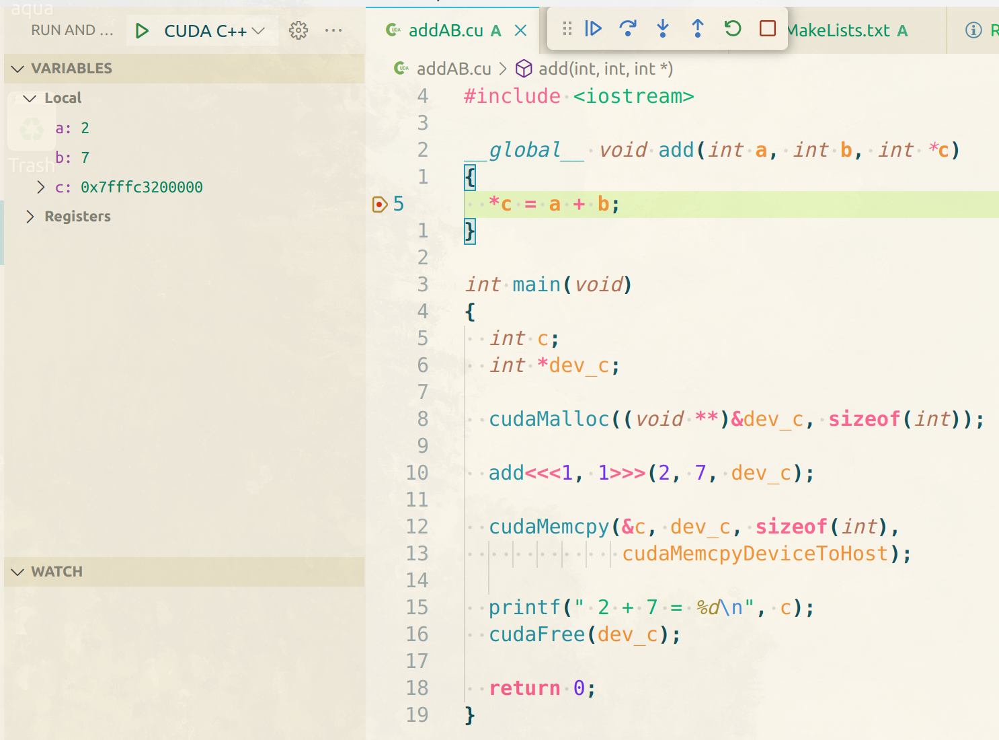

# CUDA project demo

## Prerequisites

- Ubuntu 20.04
- [miniconda](https://docs.conda.io/projects/miniconda/en/latest/)
- [NVIDIA Driver](https://docs.nvidia.com/datacenter/tesla/tesla-installation-notes/index.html#abstract)

## Installing tools using `conda`

- cuda-toolkit(12)
- gcc(12)
- gxx(12)
- cmake

  _cuda-toolkit, gcc, gxx should be same major version_

## Config CMakeLists.txt

```Cmake
cmake_minimum_required(VERSION 3.26)

project(${project_name} LANGUAGES CXX CUDA) # Enable CUDA language

set(CMAKE_CUDA_ARCHITECTURES 75) # RTX20xx, depends on your gpu

find_package(CUDAToolkit REQUIRED) # Find CUDA toolkit

set(CMAKE_BUILD_TYPE Debug)

if(CMAKE_BUILD_TYPE STREQUAL "Debug")
  target_compile_options(${target_name} PRIVATE $<$<COMPILE_LANGUAGE:CUDA>:-G>) # Enable kernel debug
endif()

add_executable(${target_name} ${file}) # Add target

target_link_libraries(${target_name} CUDA::cuda_driver) # Link CUDA libs

```

## Debugging with vscode

### Extensions

- [Nsight Visual Studio Code Edition](https://marketplace.visualstudio.com/items?itemName=NVIDIA.nsight-vscode-edition)
- [C/C++](https://marketplace.visualstudio.com/items?itemName=ms-vscode.cpptools)

### tasks.json

```Json
{
  "version": "2.0.0",
  "tasks": [
    {
      "label": "build",
      "type": "shell",
      "command": "cmake",
      "args": [
        "--build",
        "./build",
        "--config",
        "Debug",
        "--target",
        "all",
        "-j",
        "10",
        "--"
      ],
      "group": "build",
      "presentation": {
        "reveal": "silent",
      },
      "problemMatcher": "$nvcc"
    }
  ]
}
```

### launch.json

```Json
  "version": "0.2.0",
  "configurations": [
    {
      "name": "CUDA C++: Launch",
      "type": "cuda-gdb",
      "request": "launch",
      "program": "${workspaceFolder}/build/${fileBasenameNoExtension}",
      "preLaunchTask": "build"
    },
    {
      "name": "CUDA C++: Attach",
      "type": "cuda-gdb",
      "request": "attach"
    }
  ]
```

---

Just works!


